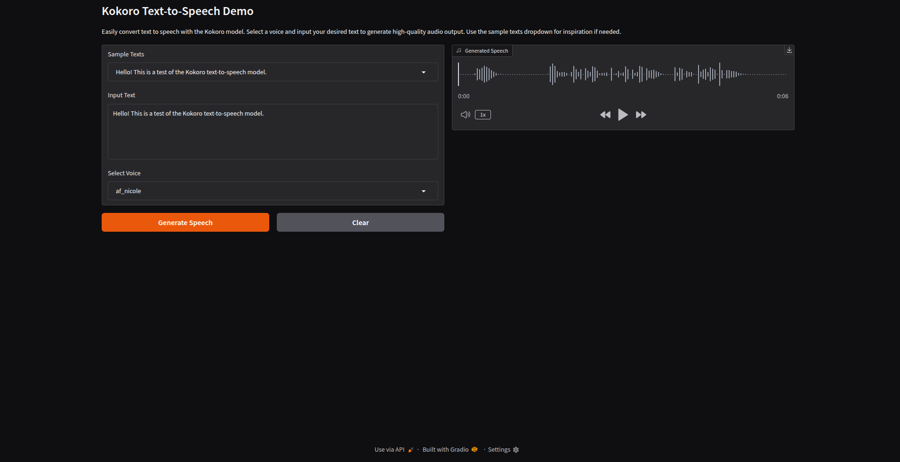

# Kokoro Text-to-Speech (TTS)

## Overview
This demo utilizes the Kokoro model for high-quality text-to-speech conversion. It allows users to input custom text, select a voice, and generate speech. The demo is built with Python and uses Gradio for creating an interactive web interface.

---

## Prerequisites
Before running the demo, ensure you have the following installed:
- Python 3.x
- Git LFS (for large model files)
- Conda (optional, but preferred)
- Required Python libraries (listed below)

---

## Installation

### 1. Set up Conda Environment (optional)
If you prefer to use a Conda environment, follow these steps:
```bash
conda create -n kokoro-tts python=3.8
conda activate kokoro-tts
```

### 2. Install Dependencies
Install the required dependencies:
```bash
git lfs install
sudo apt-get -qq -y install espeak-ng > /dev/null 2>&1
pip install -q phonemizer torch transformers scipy munch gradio
```
### 3. Clone the Kokoro Model Repository
Clone the Kokoro model repository from Hugging Face:
```bash
# If you want to clone the whole repository including large files
git clone https://huggingface.co/geneing/Kokoro
cd Kokoro
```
```bash
# If you want to clone without large files - just their pointers
GIT_LFS_SKIP_SMUDGE=1 git clone https://huggingface.co/geneing/Kokoro
cd Kokoro
```

### 4. Add the Demo Script
Copy the demo Python script into the `Kokoro` folder:
- Create a new `.py` file inside the folder where the Kokoro model files are located.
```bash
touch kokoro_tts_demo.py
```
- Copy the `kokoro_tts_demo.py` (the demo script) from this repository to your `kokoro_tts_demo.py`

### 5. Verify Model Files
Ensure the following files are in the `Kokoro` folder:
- `kokoro-v0_19.pth` model file
- Voice files in the `voices` folder

---

## Running the Demo

To run the demo, simply execute the Python script:
```python
python kokoro_tts_demo.py
```
---

## Files

- `kokoro_tts_demo.py`: Main Python script for the TTS demo.
- `README.md`: This readme file.
- `demo.png`: Screenshot of the demo.

---



## Features

- Select from available voices for TTS.
- Input your own text or choose from sample texts
- Generate and listen to high-quality speech in real-time.

---

## Dependencies

The project uses the following Python libraries:

- `gradio` (for the web interface)
- `torch` (for model loading and inference)
- `phonemizer` (for text phonemization)
- `transformers` (for model handling)
- `scipy` (for scientific computing)
- `munch` (for data manipulation)
- `espeak-ng` (for text-to-speech synthesis)

You can install these dependencies using:

```bash
pip install gradio torch phonemizer transformers scipy munch
```
